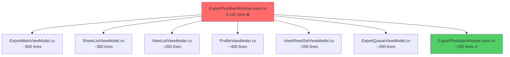

# Licorp_Export+ — Implementation Plan

## Mục tiêu

Tạo project **Licorp_Export+** trong folder `G:\My Drive\Tool Revit Code\Licorp_Export +` bằng cách:
- Hợp nhất **chỉ tính năng Export+** từ 2 folder hiện có
- Sử dụng **cùng template architecture** như `Licorp_ScheduleEditor`
- Ribbon tab chung **"Licorp"**, panel **"Export"**
- Hỗ trợ **Revit 2020 → 2026** trong 1 solution

> [!IMPORTANT]
> **CHỈ Export+ features** — Không lấy MEP Tools (Change Length, Rotate, Split Duct, DockablePanel, PlaceFamily, Con_Align, Trans Data Para, Sheet from Excel, UpDownTool).

> [!CAUTION]
> **PRIMARY SOURCE: `Export + _2025-2026`** — Folder này có tính năng tốt nhất và mới nhất. Tất cả code phải lấy từ đây làm chuẩn. Chỉ tham khảo `Export + _2020-2024` khi cần logic đặc thù cho Revit legacy (2020-2024) mà folder 2025-2026 chưa có.

---

## 1. Template Reference: Licorp_ScheduleEditor

Pattern đã được verify hoạt động:

```
Licorp_ScheduleEditor/
├── Directory.Build.props          ← Global: Company, Version, VendorId
├── Directory.Build.targets        ← Auto-deploy addin manifest
├── deploy-bundle.ps1              ← Build + deploy tất cả versions
├── Source/
│   ├── LicorpScheduleEditor.sln
│   ├── LicorpScheduleEditor.R20/  ← net48, Revit 2020-2024
│   │   └── .csproj (configs: Debug, Release R20..R25)
│   ├── LicorpScheduleEditor.R25/  ← net8.0-windows, Revit 2025-2026
│   │   └── .csproj (configs: Debug, Release R26)
│   └── LicorpScheduleEditor.Shared/  ← .shproj, ALL source code
│       ├── .projitems              ← Auto-include *.cs, Views/*.xaml
│       ├── ScheduleEditorApplication.cs  ← IExternalApplication
│       ├── ViewModels/
│       ├── Views/
│       ├── Models/
│       └── Services/
```

**Key patterns to replicate:**
- `Application.CreateRibbonTab("Licorp")` — shared tab, catch if exists
- `application.GetRibbonPanels(tabName).FirstOrDefault(p => p.Name == panelName)` — reuse panel
- `ricaun.Revit.DI` + `ricaun.Revit.UI.Tasks` — DI container + async Revit API
- `Nice3point.Revit.Build.Tasks` — auto-deploy `.addin` file
- `CommunityToolkit.Mvvm` — MVVM framework
- `Serilog` — structured logging thay Debug.WriteLine

---

## 2. Proposed Structure (Licorp_Export+)

```
Licorp_Export +/                          ← Target folder (đã tạo, đang trống)
├── Directory.Build.props                 ← Copy pattern từ ScheduleEditor
├── Directory.Build.targets               ← Deploy addin manifest
├── deploy-bundle.ps1                     ← Build + deploy script
├── .gitignore
├── README.md
│
└── Source/
    ├── LicorpExportPlus.sln
    │
    ├── LicorpExportPlus.R20/             ← net48, Revit 2020-2024
    │   └── LicorpExportPlus.R20.csproj
    │
    ├── LicorpExportPlus.R25/             ← net8.0-windows, Revit 2025-2026
    │   └── LicorpExportPlus.R25.csproj
    │
    └── LicorpExportPlus.Shared/          ← ALL shared source code
        ├── LicorpExportPlus.Shared.shproj
        ├── LicorpExportPlus.Shared.projitems
        │
        ├── ExportPlusApplication.cs       ← IExternalApplication entry
        ├── ExportPlusCommand.cs           ← IExternalCommand (show window)
        ├── Logger.cs                      ← Serilog-based logging
        │
        ├── Models/
        │   ├── SheetItem.cs
        │   ├── ViewItem.cs
        │   ├── ExportSettings.cs
        │   ├── ExportProfile.cs
        │   ├── ExportPlusXMLProfile.cs
        │   ├── DWGExportSettings.cs
        │   ├── IFCExportSettings.cs
        │   ├── NWCExportSettings.cs
        │   ├── ImageExportSettings.cs
        │   ├── XMLExportSettings.cs
        │   ├── ExportQueueItem.cs
        │   ├── PaperSize.cs
        │   ├── ParameterInfo.cs
        │   ├── ParameterProfile.cs
        │   ├── Profile.cs
        │   └── ViewSheetSetInfo.cs
        │
        ├── Services/
        │   ├── PDFExportService.cs        ← Từ PDFExportManager (46-53KB)
        │   ├── PDFPrintService.cs         ← Từ PDFExportManager_PrintManager
        │   ├── PDFOptionsApplier.cs       ← Giữ nguyên
        │   ├── DWGExportService.cs        ← Từ DWGExportManager (30KB)
        │   ├── DXFExportService.cs        ← Từ DXFExportManager (11KB)
        │   ├── IFCExportService.cs        ← Từ IFCExportManager (38KB)
        │   ├── NWCExportService.cs        ← Từ NavisworksExportManager (13KB)
        │   ├── ImageExportService.cs      ← Từ ImageExportManager (2KB)
        │   ├── XMLExportService.cs        ← Từ XMLExportManager (3.6KB)
        │   ├── BatchExportService.cs      ← Từ BatchExportManager (6-7KB)
        │   ├── ProfileService.cs          ← Từ ProfileManager + ProfileManagerService
        │   ├── XMLProfileService.cs       ← Từ XMLProfileManager (25-28KB)
        │   ├── ExportProfileService.cs    ← Từ ExportPlusProfileManager (13-16KB)
        │   ├── ViewSheetSetService.cs     ← Từ ViewSheetSetManager (16-19KB)
        │   ├── PaperSizeService.cs        ← Từ PaperSizeManager (3KB)
        │   ├── DWGCleanupService.cs       ← Từ DWGCleanupManager (6KB)
        │   ├── AutoCADBindService.cs      ← Từ AutoCADBindManager (12KB)
        │   ├── DrawingTransmittalService.cs ← Từ DrawingTransmittalManager
        │   ├── SchedulingAssistant.cs     ← Giữ nguyên (3.4KB)
        │   ├── SheetLoaderService.cs      ← Từ SheetBatchLoader + async loading
        │   └── FileNameGeneratorService.cs ← Từ FileNameGenerator (8KB)
        │
        ├── Events/
        │   ├── ExportHandler.cs           ← IExternalEventHandler
        │   ├── IFCExportHandler.cs        ← IExternalEventHandler
        │   ├── PDFExportEventHandler.cs
        │   └── ViewSheetSetEventHandler.cs
        │
        ├── ViewModels/                    ← MVVM (mới - refactor từ code-behind)
        │   ├── ExportMainViewModel.cs     ← Logic chính từ MainWindow.xaml.cs
        │   ├── SheetListViewModel.cs      ← Sheet selection + filtering
        │   ├── ViewListViewModel.cs       ← View selection + filtering
        │   ├── ProfileViewModel.cs        ← Từ MainWindow.Profiles.cs
        │   ├── ViewSheetSetViewModel.cs   ← Từ MainWindow.ViewSheetSets.cs
        │   ├── ExportQueueViewModel.cs    ← Export queue management
        │   └── BaseViewModel.cs           ← INotifyPropertyChanged base
        │
        ├── Views/
        │   ├── ExportPlusMainWindow.xaml          ← Refactored UI
        │   ├── ExportPlusMainWindow.xaml.cs        ← Minimal code-behind
        │   ├── CustomFileNameDialog.xaml
        │   ├── CustomFileNameDialog.xaml.cs
        │   ├── CustomFileNameInputDialog.xaml      ← Chỉ 2025-2026
        │   ├── CustomFileNameInputDialog.xaml.cs
        │   ├── ExportCompletedDialog.xaml
        │   ├── ExportCompletedDialog.xaml.cs
        │   ├── ProfileNameDialog.xaml
        │   ├── ProfileNameDialog.xaml.cs
        │   ├── ReorderSheetsDialog.xaml             ← Chỉ 2025-2026
        │   ├── ReorderSheetsDialog.xaml.cs
        │   ├── SaveViewSheetSetDialog.xaml
        │   ├── SaveViewSheetSetDialog.xaml.cs
        │   ├── SelectExistingSetDialog.xaml
        │   └── SelectExistingSetDialog.xaml.cs
        │
        ├── Converters/
        │   ├── UIConverters.cs
        │   └── ValueConverters.cs
        │
        ├── Utils/
        │   ├── AlphanumericComparer.cs
        │   ├── AsyncSheetViewManager.cs
        │   ├── BrowseFileBehavior.cs
        │   ├── FileNameHelper.cs
        │   ├── NotificationHelper.cs
        │   ├── ObservableRangeCollection.cs
        │   ├── ParameterUtils.cs
        │   ├── SheetBatchLoader.cs
        │   └── SheetSizeDetector.cs
        │
        └── Resources/
            └── Icons/
                └── sheet.png               ← Export+ icon
```

---

## 3. Project Files (Theo đúng template ScheduleEditor)

### 3.1 Directory.Build.props

```xml
<Project>
  <PropertyGroup>
    <CopyLocalLockFileAssemblies>true</CopyLocalLockFileAssemblies>
    <LangVersion>latest</LangVersion>
    <Nullable>warnings</Nullable>
    <ImplicitUsings>true</ImplicitUsings>
    <Company>Licorp</Company>
    <Authors>Licorp</Authors>
    <Version>1.0.0</Version>
    <Description>Licorp Export+ - Professional Batch Export for Revit</Description>
    <PublishAddinFiles>true</PublishAddinFiles>
    <DeployRevitAddin>true</DeployRevitAddin>
    <AddInId>A7E4B1C3-8D2F-4A5E-9F6B-3C1D7E8A2B5F</AddInId>
    <VendorId>LICORP</VendorId>
    <VendorDescription>Licorp, licorp.vn</VendorDescription>
  </PropertyGroup>
</Project>
```

### 3.2 LicorpExportPlus.R20.csproj (net48)

```xml
<Project Sdk="Microsoft.NET.Sdk">
  <PropertyGroup>
    <TargetFramework>net48</TargetFramework>
    <UseWPF>true</UseWPF>
    <UseWindowsForms>true</UseWindowsForms>
    <RevitVersion Condition="'$(RevitVersion)' == ''">2020</RevitVersion>
    <AssemblyName>LicorpExportPlus</AssemblyName>
    <RootNamespace>LicorpExportPlus</RootNamespace>
    <Configurations>Debug;Release R20;Release R21;Release R22;Release R23;Release R24;Release R25</Configurations>
    <GenerateAssemblyInfo>true</GenerateAssemblyInfo>
  </PropertyGroup>

  <!-- Revit Version per Configuration -->
  <PropertyGroup Condition="$(Configuration.Contains('R20'))"><RevitVersion>2020</RevitVersion></PropertyGroup>
  <PropertyGroup Condition="$(Configuration.Contains('R21'))"><RevitVersion>2021</RevitVersion></PropertyGroup>
  <PropertyGroup Condition="$(Configuration.Contains('R22'))"><RevitVersion>2022</RevitVersion></PropertyGroup>
  <PropertyGroup Condition="$(Configuration.Contains('R23'))"><RevitVersion>2023</RevitVersion></PropertyGroup>
  <PropertyGroup Condition="$(Configuration.Contains('R24'))"><RevitVersion>2024</RevitVersion></PropertyGroup>
  <PropertyGroup Condition="$(Configuration.Contains('R25'))"><RevitVersion>2025</RevitVersion></PropertyGroup>

  <!-- Shared Project Import -->
  <Import Project="..\LicorpExportPlus.Shared\LicorpExportPlus.Shared.projitems" Label="Shared" />

  <!-- Nice3point: Revit API + Toolkit + Extensions -->
  <ItemGroup>
    <PackageReference Include="Nice3point.Revit.Api.RevitAPI" Version="$(RevitVersion).*" />
    <PackageReference Include="Nice3point.Revit.Api.RevitAPIUI" Version="$(RevitVersion).*" />
    <PackageReference Include="Nice3point.Revit.Api.AdWindows" Version="$(RevitVersion).*" />
    <PackageReference Include="Nice3point.Revit.Toolkit" Version="$(RevitVersion).*" />
    <PackageReference Include="Nice3point.Revit.Extensions" Version="$(RevitVersion).*" />
    <PackageReference Include="Nice3point.Revit.Build.Tasks" Version="3.*" PrivateAssets="All" />
  </ItemGroup>

  <!-- ricaun: Revit UI, Tasks, StatusBar, DI -->
  <ItemGroup>
    <PackageReference Include="ricaun.Revit.UI" Version="*" />
    <PackageReference Include="ricaun.Revit.UI.Tasks" Version="*" />
    <PackageReference Include="ricaun.Revit.UI.StatusBar" Version="*" />
    <PackageReference Include="ricaun.Revit.DI" Version="*" />
    <PackageReference Include="ricaun.DI" Version="*" />
  </ItemGroup>

  <!-- MVVM + WPF Libraries -->
  <ItemGroup>
    <PackageReference Include="CommunityToolkit.Mvvm" Version="8.*" />
    <PackageReference Include="Microsoft.Xaml.Behaviors.Wpf" Version="1.*" />
    <PackageReference Include="WPF-UI" Version="4.*" />
  </ItemGroup>

  <!-- Excel + Data + Logging -->
  <ItemGroup>
    <PackageReference Include="EPPlus" Version="6.*" />
    <PackageReference Include="ClosedXML" Version="0.105.*" />
    <PackageReference Include="ExcelDataReader" Version="3.*" />
    <PackageReference Include="ExcelDataReader.DataSet" Version="3.*" />
    <PackageReference Include="DocumentFormat.OpenXml" Version="3.*" />
    <PackageReference Include="Newtonsoft.Json" Version="13.*" />
    <PackageReference Include="Serilog" Version="3.*" />
    <PackageReference Include="Serilog.Sinks.File" Version="5.*" />
  </ItemGroup>
</Project>
```

### 3.3 LicorpExportPlus.R25.csproj (net8.0-windows)

```xml
<Project Sdk="Microsoft.NET.Sdk">
  <PropertyGroup>
    <TargetFramework>net8.0-windows</TargetFramework>
    <UseWPF>true</UseWPF>
    <UseWindowsForms>true</UseWindowsForms>
    <RevitVersion Condition="'$(RevitVersion)' == ''">2026</RevitVersion>
    <AssemblyName>LicorpExportPlus</AssemblyName>
    <RootNamespace>LicorpExportPlus</RootNamespace>
    <Configurations>Debug;Release R26</Configurations>
    <GenerateAssemblyInfo>true</GenerateAssemblyInfo>
    <DefineConstants>$(DefineConstants);REVIT2025_OR_GREATER</DefineConstants>
  </PropertyGroup>

  <PropertyGroup Condition="$(Configuration.Contains('R26'))">
    <RevitVersion>2026</RevitVersion>
  </PropertyGroup>

  <!-- Shared Project Import -->
  <Import Project="..\LicorpExportPlus.Shared\LicorpExportPlus.Shared.projitems" Label="Shared" />

  <!-- Nice3point: Revit API + Toolkit + Extensions -->
  <ItemGroup>
    <PackageReference Include="Nice3point.Revit.Api.RevitAPI" Version="$(RevitVersion).*" />
    <PackageReference Include="Nice3point.Revit.Api.RevitAPIUI" Version="$(RevitVersion).*" />
    <PackageReference Include="Nice3point.Revit.Api.AdWindows" Version="$(RevitVersion).*" />
    <PackageReference Include="Nice3point.Revit.Toolkit" Version="$(RevitVersion).*" />
    <PackageReference Include="Nice3point.Revit.Extensions" Version="2025.*" />
    <PackageReference Include="Nice3point.Revit.Build.Tasks" Version="3.*" PrivateAssets="All" />
  </ItemGroup>

  <!-- ricaun: Revit UI, Tasks, StatusBar, DI -->
  <ItemGroup>
    <PackageReference Include="ricaun.Revit.UI" Version="*" />
    <PackageReference Include="ricaun.Revit.UI.Tasks" Version="*" />
    <PackageReference Include="ricaun.Revit.UI.StatusBar" Version="*" />
    <PackageReference Include="ricaun.Revit.DI" Version="*" />
    <PackageReference Include="ricaun.DI" Version="*" />
  </ItemGroup>

  <!-- MVVM + WPF Libraries -->
  <ItemGroup>
    <PackageReference Include="CommunityToolkit.Mvvm" Version="8.*" />
    <PackageReference Include="Microsoft.Xaml.Behaviors.Wpf" Version="1.*" />
    <PackageReference Include="WPF-UI" Version="4.*" />
  </ItemGroup>

  <!-- Excel + Data + Logging -->
  <ItemGroup>
    <PackageReference Include="EPPlus" Version="7.*" />
    <PackageReference Include="ClosedXML" Version="0.105.*" />
    <PackageReference Include="ExcelDataReader" Version="3.*" />
    <PackageReference Include="ExcelDataReader.DataSet" Version="3.*" />
    <PackageReference Include="DocumentFormat.OpenXml" Version="3.*" />
    <PackageReference Include="Newtonsoft.Json" Version="13.*" />
    <PackageReference Include="Serilog" Version="4.*" />
    <PackageReference Include="Serilog.Sinks.File" Version="6.*" />
  </ItemGroup>
</Project>
```

---

## 4. Application Entry Point (Ribbon "Licorp")

```csharp
// ExportPlusApplication.cs — theo đúng pattern ScheduleEditorApplication.cs
namespace LicorpExportPlus
{
    [Transaction(TransactionMode.Manual)]
    [Regeneration(RegenerationOption.Manual)]
    public class ExportPlusApplication : IExternalApplication
    {
        static ExportPlusApplication()
        {
            AppDomain.CurrentDomain.AssemblyResolve += OnAssemblyResolve;
        }

        private static RevitTaskService _revitTaskService;
        public static IRevitTask RevitTask => _revitTaskService;
        public static IContainer Container { get; private set; }

        public Result OnStartup(UIControlledApplication application)
        {
            // DI Container
            Container = new Container();
            Container.AddRevitSingleton(application);

            // RevitTaskService
            _revitTaskService = new RevitTaskService(application);
            _revitTaskService.Initialize();
            Container.AddSingleton<IRevitTask>(_revitTaskService);

            // ═══ SHARED RIBBON TAB "Licorp" ═══
            string tabName = "Licorp";
            try { application.CreateRibbonTab(tabName); }
            catch { /* Tab đã tồn tại (ScheduleEditor đã tạo) */ }

            // Panel "Export" trong tab "Licorp"
            string panelName = "Export";
            RibbonPanel panel = application.GetRibbonPanels(tabName)
                .FirstOrDefault(p => p.Name == panelName)
                ?? application.CreateRibbonPanel(tabName, panelName);

            // Button "Export+"
            if (!panel.GetItems().Any(item => item.Name == "ExportPlus"))
            {
                var buttonData = new PushButtonData(
                    "ExportPlus", "Export+",
                    typeof(ExportPlusApplication).Assembly.Location,
                    "LicorpExportPlus.ExportPlusCommand");
                var button = panel.AddItem(buttonData) as PushButton;
                button.ToolTip = "Export+ - Batch export to PDF, DWG, IFC, NWC";
                // Load icon...
            }

            return Result.Succeeded;
        }
    }
}
```

**Ribbon khi cả 2 add-in load cùng lúc:**
```
┌─────────────────────────────────────────────┐
│                   Licorp                     │  ← Shared tab
├───────────────────┬─────────────────────────┤
│   Data Tools      │        Export            │  ← Panels
│ ┌──────────────┐  │  ┌──────────────┐       │
│ │  Schedule    │  │  │   Export+     │       │
│ │  Editor      │  │  │              │       │
│ └──────────────┘  │  └──────────────┘       │
└───────────────────┴─────────────────────────┘
```

---

## 5. Feature Scope — CHỈ Export+

### ✅ Lấy (từ `Export/` folder)

| # | Feature | Source Files | Size |
|---|---------|-------------|------|
| 1 | **PDF Export** | PDFExportManager.cs, PDFExportManager_PrintManager.cs, PDFOptionsApplier.cs | ~70KB |
| 2 | **DWG Export** | DWGExportManager.cs | ~31KB |
| 3 | **DXF Export** | DXFExportManager.cs | ~11KB |
| 4 | **IFC Export** | IFCExportManager.cs, IFCExportHandler.cs | ~41KB |
| 5 | **NWC Export** | NavisworksExportManager.cs | ~14KB |
| 6 | **Image Export** | ImageExportManager.cs | ~2KB |
| 7 | **XML Export** | XMLExportManager.cs | ~4KB |
| 8 | **Batch Export** | BatchExportManager.cs | ~7KB |
| 9 | **Profile System** | ProfileManager.cs, ProfileManagerService.cs, ExportPlusProfileManager.cs, XMLProfileManager.cs | ~53KB |
| 10 | **ViewSheetSet** | ViewSheetSetManager.cs | ~19KB |
| 11 | **Custom FileName** | CustomFileNameDialog + FileNameGenerator | ~33KB |
| 12 | **DWG Cleanup** | DWGCleanupManager.cs, AutoCADBindManager.cs | ~19KB |
| 13 | **Paper Size** | PaperSizeManager.cs | ~3KB |
| 14 | **Drawing Transmittal** | DrawingTransmittalManager.cs | ~4KB |
| 15 | **Scheduling Assistant** | SchedulingAssistant.cs | ~3KB |
| 16 | **Main Window** | ExportPlusMainWindow.xaml/.cs, Profiles.cs, ViewSheetSets.cs | ~590KB |
| 17 | **All Models** | 17 files in Models/ | ~115KB |
| 18 | **All Utils** | 10 files in Utils/ | ~73KB |
| 19 | **Dialogs** | ProfileNameDialog, ExportCompletedDialog, SaveViewSheetSetDialog, SelectExistingSetDialog, ReorderSheetsDialog | ~56KB |

### ❌ KHÔNG lấy

| Feature | Folder | Reason |
|---------|--------|--------|
| Change Length | `Change Length/` | MEP tool, ngoài scope |
| Rotate Elements | `Rotate/` | MEP tool |
| Split Duct | `Split Duct/` | MEP tool |
| Dockable Panel | `DockablePanel/` | MEP tool panel |
| Place Family | `PlaceFamily/` | MEP tool |
| Con_Align | `Con_Align/` | MEP tool |
| Trans Data Para | `Trans Data Para/` | MEP tool |
| Sheet from Excel | `Sheet from excel/` | MEP tool |
| UpDownTool | `UpDownTool/` | MEP tool |
| Selection Filter | `Selection Filter/` | MEP tool |
| StatusBar Demo | `StatusBar Demo/` | Demo code |
| RevWise Element | `RevWise Element/` | Separate feature |
| Quoc_MEP.Core | `Quoc_MEP.Core/` | Empty/unused |
| Lib/ | `Lib/` | MEP utilities (AngleMemory, MEPLib, etc.) |

---

## 6. Refactoring Strategy — Main Window (8,132 → ~200 lines)

> [!CAUTION]
> File `ExportPlusMainWindow.xaml.cs` hiện tại là **8,132 dòng** (344KB). Đây là anti-pattern nghiêm trọng cần refactor thành MVVM.

### 6.1 Tách logic thành ViewModels



### 6.2 Tách Managers → Services

| Old (Manager) | New (Service) | Pattern change |
|---|---|---|
| `PDFExportManager.cs` (static methods) | `PDFExportService.cs` (DI injectable) | Static → Instance via DI |
| `DWGExportManager.cs` (static) | `DWGExportService.cs` (DI) | Static → Instance |
| `ExportPlusProfileManager.cs` (8,132 lines code-behind partial) | `ProfileViewModel.cs` + `ExportProfileService.cs` | Code-behind → MVVM |

### 6.3 MainWindow.Profiles.cs (55-62KB → tách riêng)

File partial class hiện tại chứa toàn bộ profile management → tách thành:
- `ProfileViewModel.cs` — UI state + commands
- `ExportProfileService.cs` — Profile persistence (save/load XML)

---

## 7. Implementation Phases

### Phase 1: Project Skeleton (Ngày 1-2)
- [ ] Tạo folder structure theo template ScheduleEditor
- [ ] `Directory.Build.props` + `Directory.Build.targets`
- [ ] `LicorpExportPlus.R20.csproj` (net48, R20-R25 configs)
- [ ] `LicorpExportPlus.R25.csproj` (net8.0-windows, R26 config)
- [ ] `LicorpExportPlus.Shared.shproj` + `.projitems`
- [ ] `LicorpExportPlus.sln` (solution với 3 projects)
- [ ] `ExportPlusApplication.cs` — entry point với Ribbon "Licorp"
- [ ] `deploy-bundle.ps1`
- [ ] `.gitignore` + Git init
- [ ] **Verify**: `dotnet build` R20 + R25 pass (empty shell)

### Phase 2: Migrate Models + Utils (Ngày 3-4)
- [ ] Copy tất cả Models/ từ 2025-2026 (version mới hơn)
- [ ] Copy tất cả Utils/ 
- [ ] Copy Converters/
- [ ] Đổi namespace `Quoc_MEP.Export.*` → `LicorpExportPlus.*`
- [ ] **Verify**: Build pass với models

### Phase 3: Migrate Services (Ngày 5-8)
- [ ] Migrate Export Managers → Services (rename + namespace)
- [ ] PDFExportService (merge PrintManager logic)
- [ ] DWG/DXF/IFC/NWC/Image/XML ExportServices
- [ ] ProfileService + XMLProfileService + ExportProfileService
- [ ] ViewSheetSetService
- [ ] BatchExportService
- [ ] Migrate Events/ (ExportHandler, IFCExportHandler, PDFEventHandler)
- [ ] Thay `Debug.WriteLine` → `Logger.Info/Warning/Error` (Serilog)
- [ ] **Verify**: Build pass

### Phase 4: Migrate Views + Create ViewModels (Ngày 9-14)
- [ ] Copy XAML views (giữ nguyên UI layout ban đầu)
- [ ] Tạo ViewModels từ code-behind logic
- [ ] `ExportMainViewModel.cs` — orchestrator
- [ ] `SheetListViewModel.cs` — sheet loading, filtering, selection
- [ ] `ProfileViewModel.cs` — từ Profiles.cs partial
- [ ] Wire up data binding (XAML `{Binding}` → ViewModel)
- [ ] Giảm `ExportPlusMainWindow.xaml.cs` xuống ~200 dòng
- [ ] **Verify**: UI hiển thị đúng, basic interactions work

### Phase 5: Integration + Test (Ngày 15-17)
- [ ] `ExportPlusCommand.cs` — với window caching pattern
- [ ] Wire up `ricaun.Revit.UI.Tasks` cho async export operations  
- [ ] DI registration trong `ExportPlusApplication.cs`
- [ ] Build tất cả configurations (R20 → R26)
- [ ] Deploy lên Revit 2023 test
- [ ] Deploy lên Revit 2026 test
- [ ] Test: PDF export, DWG export, Profile save/load

---

## 8. Namespace Mapping

| Old Namespace | New Namespace |
|---|---|
| `Quoc_MEP` | `LicorpExportPlus` |
| `Quoc_MEP.Export` | `LicorpExportPlus` |
| `Quoc_MEP.Export.Views` | `LicorpExportPlus.Views` |
| `Quoc_MEP.Export.Models` | `LicorpExportPlus.Models` |
| `Quoc_MEP.Export.Managers` | `LicorpExportPlus.Services` |
| `Quoc_MEP.Export.Commands` | `LicorpExportPlus.Events` |
| `Quoc_MEP.Export.Events` | `LicorpExportPlus.Events` |
| `Quoc_MEP.Export.Utils` | `LicorpExportPlus.Utils` |
| `Quoc_MEP.Export.Converters` | `LicorpExportPlus.Converters` |
| `Quoc_MEP.Export.Services` | `LicorpExportPlus.Services` |
| `Quoc_MEP.Lib` | `LicorpExportPlus.Utils` |

---

## Decisions (FINALIZED ✅)

| # | Quyết định | Kết quả |
|---|---|---|
| 1 | **Assembly name** | `LicorpExportPlus.dll` ✅ |
| 2 | **ricaun packages** | Dùng cho tất cả versions (giống ScheduleEditor) ✅ |
| 3 | **EPPlus + ClosedXML** | Giữ cả 2 (optimize sau) ✅ |
| 4 | **Primary source** | `Export + _2025-2026` là chuẩn ✅ |
| 5 | **Ribbon tab** | "Licorp" (shared với ScheduleEditor) ✅ |

---

## Verification Plan

### Build
```powershell
# Build R20 (covers 2020-2024)
dotnet build "Source\LicorpExportPlus.R20\LicorpExportPlus.R20.csproj" -c Debug

# Build R25 (covers 2025-2026)
dotnet build "Source\LicorpExportPlus.R25\LicorpExportPlus.R25.csproj" -c Debug
```

### Deploy
```powershell
.\deploy-bundle.ps1
# → C:\ProgramData\Autodesk\ApplicationPlugins\LicorpExportPlus.bundle\Contents\20XX\
```

### Manual Test
1. Load Revit 2023 → Tab "Licorp" hiển thị → Panel "Export" → Click "Export+" → Window hiện
2. Load Revit 2026 → Tab "Licorp" hiển thị → Panel "Export" → Click "Export+" → Window hiện
3. Test cùng lúc với ScheduleEditor → cả 2 button hiện trong tab "Licorp"
4. Export PDF → file output chính xác
5. Profile save/load → persistence hoạt động
